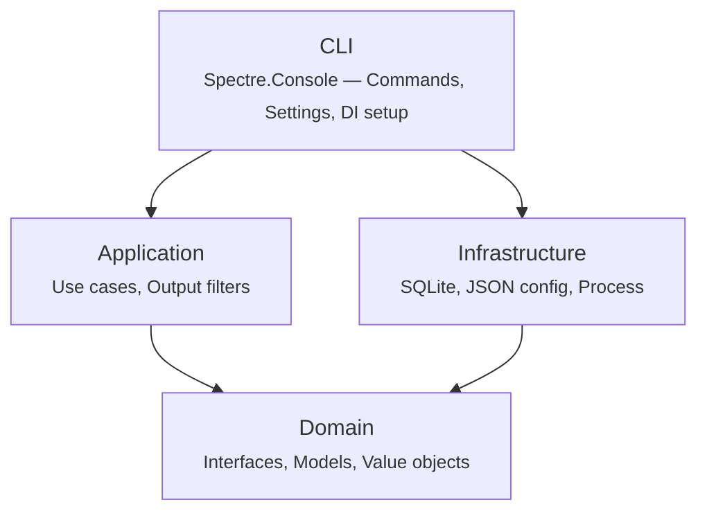

# Architecture

DotnetTokenKiller follows a clean architecture pattern with four layers, each in its own project.

## Project Structure

```sh
src/
├── DotnetTokenKiller.Domain/           Core abstractions
├── DotnetTokenKiller.Application/      Use cases and filters
├── DotnetTokenKiller.Infrastructure/   External integrations
└── DotnetTokenKiller.Cli/              CLI entry point
```

## Layer Diagram



Dependencies flow inward: CLI → Application → Domain, and Infrastructure → Domain. The CLI layer wires everything together via dependency injection.

## Domain

The innermost layer defines core abstractions with no external dependencies.

| Folder | Contents |
|--------|----------|
| `Configuration/` | `DtkConfig` (configuration model), `IConfigProvider` (config loading interface) |
| `Execution/` | `CommandResult` (return value from running a command), `ICommandRunner` (process execution interface) |
| `Filters/` | `IOutputFilter` (contract for transforming raw output to filtered output) |
| `Tracking/` | `CommandRecord`, `CommandGainDetail`, `GainSummary` (tracking models), `ITracker` (persistence interface) |
| `Tee/` | `ITeeService` (raw output logging interface) |

## Application

Contains the business logic — use cases and per-command output filters.

### Use Cases

| Class | Purpose |
|-------|---------|
| `FilteredRunUseCase` | Runs a `dotnet` command, filters its output, tracks token usage, and optionally tees the raw output |
| `GainReportUseCase` | Aggregates tracking data and produces the savings report |
| `ResetTrackingUseCase` | Clears all stored tracking records |

### Filters

Each supported `dotnet` subcommand has a dedicated filter implementing `IOutputFilter`:

| Filter | Command |
|--------|---------|
| `DotnetBuildFilter` | `dotnet build` |
| `DotnetTestFilter` | `dotnet test` |
| `DotnetRestoreFilter` | `dotnet restore` |
| `DotnetCleanFilter` | `dotnet clean` |
| `DotnetFormatFilter` | `dotnet format` |
| `DotnetListPackageFilter` | `dotnet list package` |

These filters parse the raw `dotnet` output and produce compact, LLM-friendly summaries — stripping MSBuild noise, adapter banners, absolute paths, and duplicate information.

## Infrastructure

Implements domain interfaces with concrete external integrations.

| Class | Implements | Description |
|-------|------------|-------------|
| `ProcessCommandRunner` | `ICommandRunner` | Spawns `dotnet` as a child process and captures output |
| `SqliteTracker` | `ITracker` | Persists command records and token counts in SQLite |
| `JsonConfigProvider` | `IConfigProvider` | Reads and deserializes `~/.config/dtk/config.json` |

## CLI

The entry point, built with [Spectre.Console.Cli](https://spectreconsole.net/).

| Component | Purpose |
|-----------|---------|
| `Program.cs` | Registers services, configures commands, handles passthrough for unknown subcommands |
| `Commands/` | One command class per CLI verb (DotnetBuildCommand, DotnetTestCommand, GainCommand, ResetCommand, etc.) |
| `Infrastructure/` | Spectre.Console DI integration (`TypeRegistrar`, `TypeResolver`) |

## Key Dependencies

| Package | Purpose |
|---------|---------|
| [Spectre.Console](https://spectreconsole.net/) | Rich terminal output (tables, colors, emoji) |
| [Spectre.Console.Cli](https://spectreconsole.net/) | CLI command framework |
| [Microsoft.ML.Tokenizers](https://www.nuget.org/packages/Microsoft.ML.Tokenizers) | BPE token counting (cl100k_base, o200k_base, etc.) |
| [Microsoft.Data.Sqlite](https://www.nuget.org/packages/Microsoft.Data.Sqlite) | Tracking data persistence |
| [Microsoft.Extensions.DependencyInjection](https://www.nuget.org/packages/Microsoft.Extensions.DependencyInjection) | Service container |

## Target Framework

- **.NET 10** (`net10.0`)
- C# 14 with nullable reference types enabled
- Analyzers: Roslynator, SonarAnalyzer, Microsoft.CodeAnalysis.NetAnalyzers
- `TreatWarningsAsErrors` enabled
